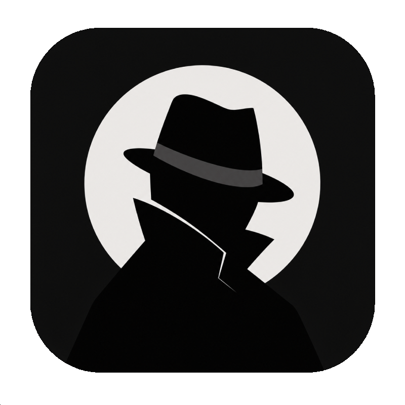

# NoirPlayer



A dual-video player for Windows — built for situations where the same movie or show exists in two different versions and you want to flip between them **while they're both playing**. Color grade vs. black-and-white cut for example — whatever the case, both play simultaneously and stay in sync, and you switch with a single keypress.

---

## What it does

You load two video files at launch. Both start playing, locked in sync. One is shown on top at a time — press Tab (or S, or the mouse side buttons) and the other flips forward instantly. Audio switches too, no overlap. If they drift apart over time, it auto-corrects every 2 seconds.

Subtitles are per-file and fully customizable — font, size, position, color, outline, bold/italic. Keyword-based auto-selection picks the right track so you don't have to do it manually every time. You can also load an external SRT/ASS file if the video doesn't have embedded subs.

---

## Supported formats

Anything ffmpeg handles. Specifically tested with:

| Format | Extension |
|--------|-----------|
| Matroska | `.mkv` |
| MPEG-4 | `.mp4` |
| AVI | `.avi` |
| QuickTime | `.mov` |
| Blu-ray stream | `.m2ts`, `.ts` |
| Windows Media | `.wmv` |
| WebM | `.webm` |
| Flash Video | `.flv` |

External subtitle formats: `.srt`, `.ass`, `.ssa`, `.sub`

---

## Requirements

- **Python 3.10+** — [python.org](https://www.python.org/downloads/)
- **mpv** — setup depends on your OS (see below)

---

## Setting up mpv

### Windows

mpv needs to be downloaded manually and placed in the `mpv/` folder.

**Step 1 — Download**

Go to the releases page: **https://github.com/shinchiro/mpv-winbuild-cmake/releases**

From the latest release, download these two files:

| File | What to grab |
|------|-------------|
| `mpv-x86_64-[date].7z` | Main portable build |
| `mpv-dev-x86_64-[date].7z` | Developer package (contains the DLL) |

**Step 2 — Place the files**

From `mpv-x86_64-[date].7z`:
```
mpv.exe  →  NoirPlayer/mpv/mpv.exe
```

From `mpv-dev-x86_64-[date].7z`:
```
libmpv-2.dll  →  NoirPlayer/mpv/mpv-2.dll
```

> Rename `libmpv-2.dll` to `mpv-2.dll` when placing it.

Your `mpv/` folder should look like this:
```
NoirPlayer/
└── mpv/
    ├── mpv.exe
    └── mpv-2.dll
```

---

### Linux

Install libmpv through your package manager — no manual downloads needed.

**Debian / Ubuntu**
```bash
sudo apt install libmpv-dev
```

**Fedora**
```bash
sudo dnf install mpv-libs
```

**Arch**
```bash
sudo pacman -S mpv
```

---

### macOS

Install mpv via Homebrew — no manual downloads needed.

```bash
brew install mpv
```

If you don't have Homebrew: **https://brew.sh**

---

## Installation

```bash
git clone https://github.com/unitreign/NoirPlayer.git
cd NoirPlayer
```

Set up mpv for your OS as described above, then run:

**Windows:**
```
launch.bat
```

**Linux / macOS:**
```bash
chmod +x launch.sh
./launch.sh
```

The launch script creates a virtual environment, installs Python dependencies, and starts the app. After the first run it just launches directly.

---

## Usage

1. Run `launch.bat` (Windows) or `./launch.sh` (Linux/macOS)
2. Select your two video files — or drag and drop them onto the picker areas
3. Optionally type subtitle keywords like `English, SDH` to auto-select the right track, or browse for an external SRT file
4. Hit **Play**

### Keyboard shortcuts

All bindings are configurable from the Settings panel. Defaults:

| Key | Action |
|-----|--------|
| `Tab` | Switch between the two versions |
| `S` | Switch (alternate binding) |
| `Space` | Play / Pause |
| `←` / `→` | Seek back / forward 5 seconds |
| `F` | Toggle fullscreen |
| `Esc` | Exit fullscreen / close |
| Mouse side buttons | Switch versions |

### Timeline

A scrubber bar sits at the bottom of the player. Click or drag to seek. It disappears after 5 seconds of inactivity alongside the cursor, and comes back when you move the mouse.

---

## Settings

Hit **Settings** from the launcher.

- **Key Bindings** — rebind any action
- **Subtitles** — font (default or browse for a TTF/OTF file), size, position, color, outline, bold, italic — with a live preview
- **About** — version and Ko-fi link

---

## Custom fonts

Drop `.ttf` or `.otf` files into the `fonts/` folder — they load automatically on startup and are available to both the UI preview and mpv's subtitle renderer.

---

## Support

If you find it useful:

[](https://ko-fi.com/U7U41U5JQ)

---

## License

GNU General Public License v2.0 or later. See `LICENSE` for details.
